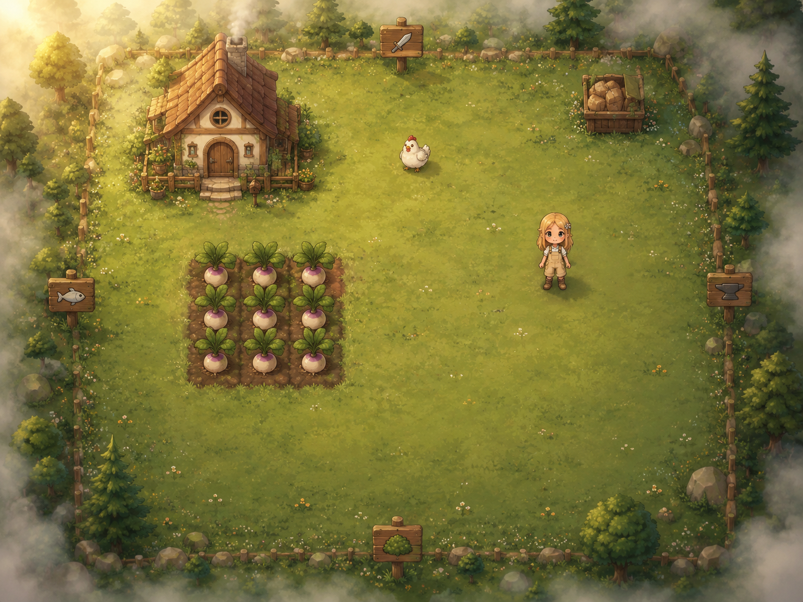

# Tale of Turnips Two 🌱

A cozy, old-Flash-inspired farming adventure that runs entirely in your
browser. Grow crops, befriend a chicken named Clementine, charm a shy
villager, collect the Starless Set, and quiet the heart of the ruins.

**▶ Play it here: <https://hannhan-hen.github.io/tale-of-turnips-two/>**



## How to play

| Key | Action |
| --- | --- |
| WASD / arrows | move |
| E / Enter | interact (plant, harvest, talk, open, fish...) |
| Space | swing your sword (once you own one) |
| 1 2 3 | choose seeds |
| Esc | close menus |

Touch controls appear automatically on phones and tablets.

- A day lasts about a minute. Crops grow each morning; sell them at the
  shipping box.
- Pet the chicken daily, gather forest berries, fish at the lake.
- Buy seeds from Marigold and gear from Bramble in the village. Old Pip
  always knows what to do next. Jay is... around. By the gate. Being shy.
- After a week of peace the ruins stir: threat rises every few days, and
  at high threat crop nibblers raid your farm. Defeating ruin bosses
  calms things down.
- Clear all six ruin rooms, claim the five-piece Starless Set, and
  defeat the Ruin Heart. Your final gold becomes your high score.

Progress saves automatically in your browser (`localStorage`).

## Tech

No engine, no build step, no image assets: every sprite, map and UI icon
is hand-authored vector art drawn with the Canvas 2D API at device-pixel
resolution, so the game stays crisp at any size. Plain ES modules,
deployed straight to GitHub Pages.

```
src/
  art.js      painter helpers (gradients, foliage, fog, paths)
  props.js    cottage, shops, signs, plots, gates...
  sprites.js  farmer, chicken, villagers, monsters
  maps.js     the seven-plus hand-composed screens
  render.js   layer caching + depth-sorted compositing
  game.js     farming, combat, threat, romance, win/lose
  ui.js       HUD, menus, dialogue, ending (DOM)
```

### Development

```bash
npm install            # dev-only: node-canvas + tooling
node tools/test.mjs    # headless gameplay smoke tests
node tools/shot.mjs    # render screenshots of every scene to shots/
npx serve .            # or any static server, then open localhost
```

### Deploying

GitHub Pages serves the `gh-pages` branch. To release whatever is on
`main`:

```bash
git push origin main:gh-pages
```

(Note: this push must be made with user credentials — pushes made by a
workflow's `GITHUB_TOKEN` produce Pages builds that fail OIDC auth, so
there is deliberately no deploy workflow.)
